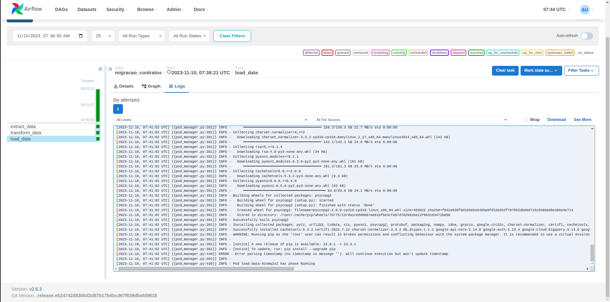
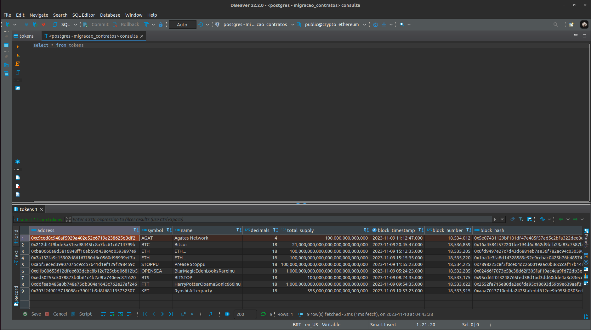

# Desafio de Migração de Contratos Inteligentes usando Airflow e Kubernetes

# Introdução

Este repositório contém a solução para o [desafio de migração de dados de contratos inteligentes](https://github.com/LuizGustavus/challenge-pld/blob/main/Desafio_para_time_de_PLD.pdf) usando Kubernetes e Docker Engine. O objetivo é criar uma DAG (Directed Acyclic Graph) que lê dados de contratos inteligentes do BigQuery e os migra para um banco Postgres local em um cluster Kubernetes. Como solicitado nas instruções do desafio, o Airflow utilizado foi criado a partir das instruções do projeto [mwaa-local-runner](https://github.com/aws/aws-mwaa-local-runner).

Obs: A solução proposta considera a utilização de um ambiente Linux

# Pré-requisitos

Certifique-se de ter os seguintes itens instalados antes de começar (considerando um ambiente Linux):

1. **Docker Engine:**

   - [Instalação do Docker Engine no Ubuntu](https://docs.docker.com/engine/install/ubuntu/)

2. **Docker Compose:**

   - [Instalação do Docker Compose no Ubuntu](https://docs.docker.com/compose/install/)

3. **Kubernetes (kind):**

   - [Instalação do kind no Ubuntu](https://kind.sigs.k8s.io/docs/user/quick-start/)

4. **kubectl:**

   - [Instalação do kubectl no Ubuntu](https://kubernetes.io/docs/tasks/tools/install-kubectl-linux/)

5. **pip:**

   - [Instalação do pip](https://pip.pypa.io/en/stable/installation/)

6. **psql:**

   - [Instalação do psql com pip](https://pypi.org/project/postgres/)

# Configuração

## 1. Clone este repositório:

```bash
git clone https://github.com/LuizGustavus/challenge-pld
cd challenge-pld
```

## 2. Execute o projeto mwaa-local-runner:

### 2.1 Entre no diretório do projeto:

```bash
cd aws-mwaa-local-runner
```

### 2.2 Execute o ambiente Apache Airflow local:

OBS: Certifique-se de não ter nenhuma aplicação rodando na porta 8080.

```bash
./mwaa-local-env start
```

Com isso, você terá o Apache Airflow rodando localmente em um _contêiner_ Docker associado a um banco Postgres em outro _contêiner_ para armazenamento de metadados. Além disso, o Airflow já possui a DAG [contratos-inteligentes.py](https://github.com/LuizGustavus/challenge-pld/blob/main/aws-mwaa-local-runner/dags/contratos-inteligentes.py) e todas as [dependências](https://github.com/LuizGustavus/challenge-pld/blob/main/aws-mwaa-local-runner/requirements/requirements.txt) necessárias instaladas.

### ATENÇÃO: Ao finalizar esta etapa, seu terminal ficará preso recebendo logs do _contêiner_ que está executando o Airflow. Para as próximas etapas, abra um novo terminal no diretório origem deste projeto.

## 3. Execute localmente um cluster Kubernetes com um banco Postgres para receber os dados:

### 3.1 Entre no diretório k8s:

```bash
cd k8s
```

### 3.2 Execute o _script_ [init.sh](https://github.com/LuizGustavus/challenge-pld/blob/main/k8s/init.sh) para criar o cluster Kubernetes local com o banco Postgres:

```bash
bash init.sh
```

O script criará o cluster Kubernetes via _kind_ usando [este arquivo de configuração](https://github.com/LuizGustavus/challenge-pld/blob/main/k8s/manifests/kind-config.yaml), alocando-o em um contêiner Docker. O contêiner já estará equipado com os arquivos de execução, configuração e dependências necessários, disponíveis no diretório [contratos-inteligentes](https://github.com/LuizGustavus/challenge-pld/blob/main/k8s/contratos-inteligentes), para a execução da solução.

Além disso, o script também criará todos os manifestos necessários para a execução do banco de dados Postgres, incluindo o [volume persistente](https://github.com/LuizGustavus/challenge-pld/blob/main/k8s/manifests/pv.yaml), o [claim do volume persistente](https://github.com/LuizGustavus/challenge-pld/blob/main/k8s/manifests/pvc.yaml), os [secrets](https://github.com/LuizGustavus/challenge-pld/blob/main/k8s/manifests/secret.yaml), o [_deployment_](https://github.com/LuizGustavus/challenge-pld/blob/main/k8s/manifests/postgres-deployment.yaml) e o [_service_](https://github.com/LuizGustavus/challenge-pld/blob/main/k8s/manifests/postgres-service.yaml). Adicionalmente, o script gerará o arquivo kubeconfig.json contendo a configuração de conexão do cluster, utilizado para a comunicação do Airflow com o cluster Kubernetes.

Por fim, o script também se encarregará de criar a tabela `tokens` no Postgres, a qual será responsável por receber os dados da solução.

OBS: Neste momento, você terá o cluster e o Airflow em execução.

## 4. Configure o Airflow para se comunicar com o cluster Kubernetes:

- Acesse a interface web do Airflow através da URL [0.0.0.0:8080](http://0.0.0.0:8080).
- Faça login com o usuário predefinido:
  - Username: **admin**
  - Password: **test**
- Na aba Admin -> Connections, encontre o item kubernetes_default e clique para editar.
- No campo ***Kube config (JSON format)***, insira o conteúdo do arquivo [kubeconfig.json](https://github.com/LuizGustavus/challenge-pld/blob/main/k8s/kubeconfig.json) gerado na etapa anterior e salve.
- Associe o _contêiner_ do Airflow à _network_ do Kubernetes, executando o seguinte comando em seu terminal:

```bash
docker network connect kind aws-mwaa-local-runner-2_6_local-runner_1
```

OBS: Caso encontre algum erro nessa estapa será necessário verificar qual é a _netowork_ que Docker _contêiner_ com o cluster Kubernets está (deveria ser **kind**) e também verificar o nome do _contêiner_ que está rodando o Airflow (deveria ser **aws-mwaa-local-runner-2_6_local-runner_1**).

# Executando a Solução

Para verificar e acompanhar a execução da solução, siga os passos abaixo:

1. Acesse o painel web do Airflow através da URL [0.0.0.0:8080](http://0.0.0.0:8080).

2. Na lista de DAGs, encontre e selecione a DAG chamada `migracao_contratos`.

3. No canto superior esquerdo, clique no botão de acionamento da DAG (Pause/Unpause DAG) para iniciar a execução.

4. No canto superior direito, ative a opção de atualização automática para visualizar em tempo real o progresso da execução.

5. Acompanhe a execução e os logs de cada task:
   - `extract_data`: Tarefa responsável pela extração de dados.
   - `transform_data`: Tarefa responsável pela transformação dos dados.
   - `load_data`: Tarefa responsável pelo carregamento dos dados no banco Postgres.

Estes passos permitirão que você monitore e analise detalhadamente cada etapa da execução da DAG `migracao_contratos`.

# Estrutura do Projeto

O projeto está organizado de forma detalhada, com os seguintes componentes:

## 1. aws-mwaa-local-runner: Repositório para execução do Airflow

- **aws-mwaa-local-runner/dags/migracao_contratos.py:**
  Implementação da DAG (`migracao_contratos.py`) responsável pela migração de dados. Este arquivo descreve as tarefas e o fluxo de execução para a extração, transformação e carga dos dados no banco Postgres.

- **aws-mwaa-local-runner/requirements/requirements.txt:**
  Dependências do Airflow para interagir com o Kubernetes.

## 2. k8s: Repositório para execução do Kubernetes

- **k8s/contratos-inteligentes:**
  Pasta contendo arquivos de execução, configuração e dependências da solução.

- **k8s/contratos-inteligentes/config/credencials.json:**
  Arquivo com credenciais para acessar o projeto "bigquery-public-data" através do BigQuery do Google Cloud Platform.

- **k8s/contratos-inteligentes/requirements/requirements.txt:**
  Bibliotecas a serem instaladas no pod de execução dos scripts.

- **k8s/contratos-inteligentes/scripts/extract.py:**
  Script responsável por extrair dados do projeto "bigquery-public-data".

- **k8s/contratos-inteligentes/scripts/transform.py:**
  Script responsável por transformar os dados.

- **k8s/contratos-inteligentes/scripts/load.py:**
  Script responsável por carregar dados no Postgres.

- **k8s/manifests:**
  Pasta contendo os manifestos do Kubernetes.

- **k8s/manifests/kind-config.yaml:**
  Configuração do cluster Kubernetes.

- **k8s/manifests/postgres-deployment.yaml:**
  Configuração do pod (execução) do Postgres.

- **k8s/manifests/postgres-service.yaml:**
  Configuração do service (exposição) do Postgres.

- **k8s/manifests/pv.yaml:**
  Configuração do Volume Persistente para o Postgres.

- **k8s/manifests/pvc.yaml:**
  Configuração do claim Volume Persistente para o Postgres.

- **k8s/manifests/secret.yaml:**
  Configuração do secret para o Postgres.

- **k8s/init.sh:**
  Script em Bash automatizado para a criação de recursos no cluster Kubernetes.

- **k8s/kubeconfig.json:**
  Arquivo de contexto para conexão com o cluster Kubernetes.

## 3. pictures: Repositório com Fotos de Demonstração

- **pictures/dag_execution.png:**
  Captura de tela do log da interface web do Airflow, indicando que a DAG está sendo executada corretamente e os dados estão sendo migrados.

- **pictures/db_query.png:**
  Captura de tela de uma consulta no banco de dados, evidenciando que os dados foram migrados com sucesso para o Postgres.

## 4. Desafio_para_time_de_PLD.pdf: Arquivo com descrição do projeto

## 5. README.md: Arquivo com instruções do projeto

# Observações

Ao implementar a solução, considere as seguintes configurações e detalhes:

## 1. Configurações da DAG:

- A DAG está programada para ser executada diariamente às 08:00 UTC, iniciando em 01/09/2023.

- Cada task está configurada para 3 retentativas, com um intervalo de espera de um minuto entre cada tentativa.

## 2. Configurações das Tasks:

- Todas as tasks são realizadas utilizando o operador `KubernetesPodOperator` na versão 7.1.0.

- Os pods executam sempre a imagem Python 3.10.

- A migração é incremental e baseada na coluna `block_timestamp`, inserindo apenas dados do dia anterior à execução da DAG.

## 3. Estrutura dos Scripts:

- Os scripts necessários para a execução da DAG foram inseridos no container que roda o cluster Kubernetes, através do diretório "k8s/contratos-inteligentes/".

- Esses scripts são inseridos no caminho `/contratos-inteligentes` no container do cluster Kubernetes.

- Este diretório do cluster foi mapeado como volume no momento da execução de cada task, permitindo o acesso aos arquivos de script, requirements e dados de configuração.

Essas configurações garantem a execução suave da DAG e a migração incremental dos dados, otimizando o processo de migração de contratos inteligentes.

# Conclusão

O código fonte, as configurações e os scripts necessários para a execução desta solução estão disponíveis neste repositório. Certifique-se de seguir as instruções de configuração e execução para garantir o correto funcionamento da DAG e a migração bem-sucedida dos dados para o banco Postgres.

# Demonstrações

A seguir, apresentam-se capturas de tela que evidenciam o êxito da execução da DAG e a migração efetiva dos dados:

## 1. Log da Interface Web do Airflow



Captura de tela do log da interface web do Airflow, indicando a execução bem-sucedida da DAG e o progresso na migração dos dados.

## 2. Consulta no Banco de Dados Postgres



Captura de tela de uma consulta realizada no banco de dados Postgres, confirmando que os dados foram migrados com sucesso.

Essas demonstrações oferecem uma visão visual do processo de execução da DAG e validam a eficácia da migração dos contratos inteligentes para o Postgres.
